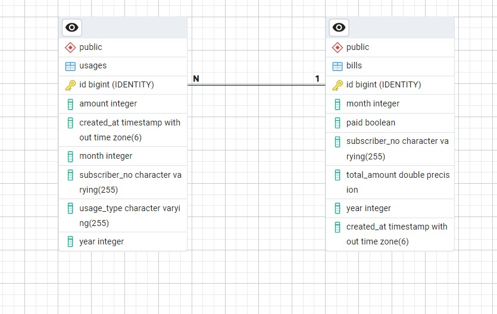

# Mobile Provider Billing API (SE4458 Midterm Project)

This project is a Spring Boot RESTful API built for a mobile service provider to track and calculate customer bills based on their usage of CALL and DATA services. It was developed as part of the SE4458 Software Engineering course.

## Features

- User Authentication with JWT
- Usage Recording for CALL and DATA
- Bill Calculation based on usage
- Bill Payment management
- Bill Detail Query with pagination
- Swagger Documentation with secure JWT testing
- PostgreSQL Integration
- Docker Support for deployment (Render, Railway, etc.)

## Billing Rules

### CALL
- Each call unit (1 minute) is assumed to be part of total usage tracking, but no specific billing logic is applied in this version.

### DATA
- First 20GB → $50
- Every extra 10GB → +$10

Usage is recorded in MB but calculated in GB internally during billing.

## Authentication

To access protected endpoints:

1. Use `/api/v1/auth/login` with:
   - Username: admin
   - Password: password
2. Copy the returned JWT token.
3. Click "Authorize" in Swagger and paste the token as:
   ```
   Bearer <your-token-here>
   ```

## API Endpoints

| Endpoint                  | Method | Auth Required | Description                                 |
|--------------------------|--------|---------------|---------------------------------------------|
| `/api/v1/auth/login`     | POST   | No            | Login and get JWT token                     |
| `/api/v1/usages`         | POST   | Yes           | Add usage data (CALL or DATA)               |
| `/api/v1/usages`         | GET    | Yes           | List all usage records                      |
| `/api/v1/bill/calculate` | POST   | Yes           | Calculate and save internet bill            |
| `/api/v1/bill/detailed`  | GET    | Yes           | Get detailed usage (with pagination)        |
| `/api/v1/bill`           | GET    | Yes           | Query bill amount and payment status        |
| `/api/v1/bill/pay`       | POST   | Yes           | Mark a bill as paid                         |

## Tech Stack

- Java 17
- Spring Boot 3.x
- Spring Security
- Spring Data JPA
- PostgreSQL
- Swagger UI (Springdoc OpenAPI)
- Maven
- Docker

## Docker Deployment

### Dockerfile

The Dockerfile automatically builds the JAR and runs the app:

```dockerfile
FROM maven:3.9.4-eclipse-temurin-17 AS build
WORKDIR /app
COPY pom.xml .
RUN mvn dependency:go-offline
COPY . .
RUN mvn clean package -DskipTests

FROM eclipse-temurin:17-jdk-alpine
WORKDIR /app
COPY --from=build /app/target/*.jar app.jar
ENTRYPOINT ["java", "-jar", "app.jar"]
```

To build and run:

```bash
docker build -t mobile-api .
docker run -p 8080:8080 mobile-api
```

## Project Structure

```
src/
├── config/           # JWT and Swagger configs
├── controller/       # REST endpoints
├── dto/              # Request/response DTOs
├── entity/           # JPA entities
├── repository/       # Spring Data repositories
├── service/          # Business logic
└── model/            # AuthRequest model
```

## Example Login Request

```json
POST /api/v1/auth/login
{
  "username": "admin",
  "password": "password"
}
```

## Sample Usage Record

```json
POST /api/v1/usages
{
  "subscriberNo": "1001",
  "usageType": "CALL",
  "month": 4,
  "year": 2025,
  "amount": 30,
  "createdAt": "2025-04-23T10:15:30"
}
```

## Sample Bill Query

```http
GET /api/v1/bill?subscriberNo=1001&month=4&year=2025
```

## Entity-Relationship Diagram

A visual representation of the database structure used in this project:

